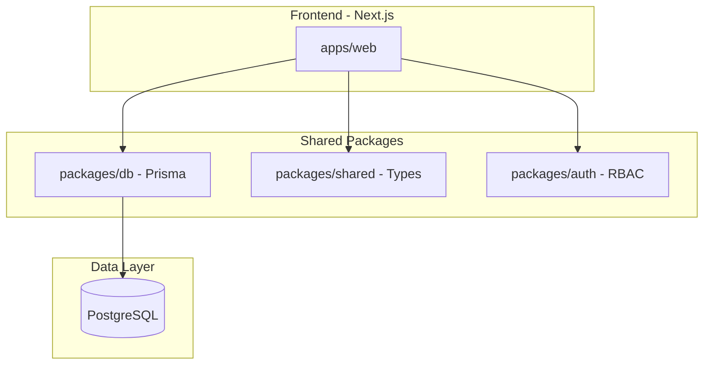
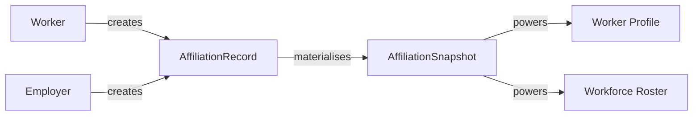

# ElasticOS Architecture

## Overview

ElasticOS transforms employment from binary states (employed/unemployed) into continuous, measurable engagement via **Engagement Intensity** E ∈ [0, 1].

## Phase 0 — Foundations

### System Architecture

### Build Order

1. **Stage 1: Identity** — Auth, RBAC, verification stubs
2. **Stage 2: Ledger** — Append-only affiliation records
3. **Stage 3: Worker Profile** — Skills, certs, portfolio
4. **Stage 4: Employer Registry** — Roster, departments, CSV import

### Data Flow

### Key Invariants

- **Ledger**: Append-only; no updates or deletes on `AffiliationRecord`
- **RBAC**: Worker sees own data; Employer sees own roster; Government sees aggregated (Phase 4)
- **One active affiliation** per worker–employer pair at a time

### API Structure

| Domain | Base Path | Auth |
|--------|-----------|------|
| Auth | `/api/auth/*` | Public (register) / Session |
| Verify | `/api/verify/*` | Session |
| Ledger | `/api/ledger/*` | Session + RBAC |
| Workers | `/api/workers/*` | Session + Worker/Employer |
| Employers | `/api/employers/*` | Session + Employer |
