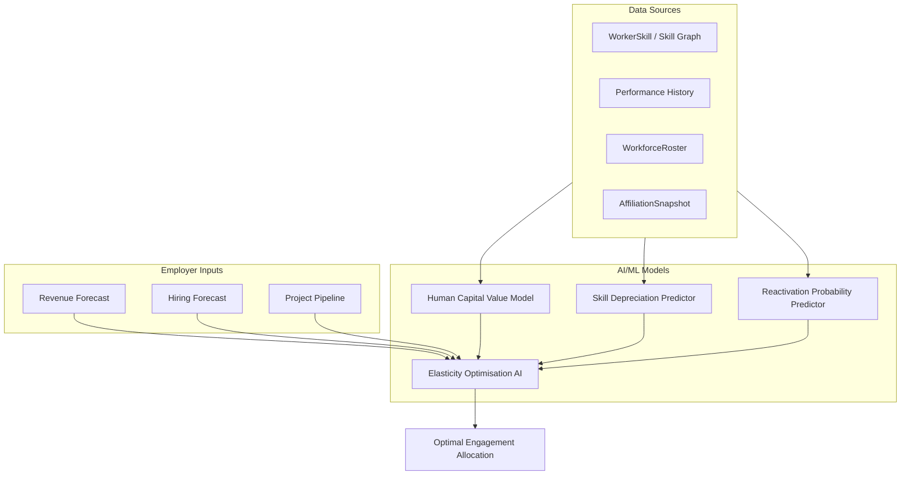

# Phase 2 — AI Elasticity Engine (Months 9–18)

**Goal:** Introduce intelligence into elasticity decisions. This phase creates the core competitive moat.

---

## Overview

Phase 2 adds four interconnected AI/ML capabilities that turn ElasticOS from a manual elasticity platform into an intelligent workforce optimisation system.



---

## Feature 6: Human Capital Value Model

### Purpose
Calculate human capital asset value per worker to inform retention vs termination decisions.

### Inputs
| Input | Source | Notes |
|------|--------|-------|
| Skill rarity | `WorkerSkill` + skill graph (new) | Rarity = inverse of supply in labour market |
| Performance history | New model or integration | Ratings, project outcomes, tenure |
| Replacement cost estimate | `SalaryBand`, market data | Hiring + onboarding + ramp-up cost |
| Time-to-replacement estimate | Role + market data | Days/months to find + onboard replacement |

### Outputs
- **Human Capital Value Score** (0–100 or normalized 0–1)
- Stored per worker-employer for dashboard and optimisation

### Backend Components
- **ML model**: Regression or ranking model (skill rarity, tenure, performance → score)
- **Human capital scoring service**: `apps/web/src/lib/ai/human-capital.ts` or dedicated `packages/ai`

### Schema Additions (Phase 2)

```prisma
model HumanCapitalScore {
  id                String   @id @default(cuid())
  workerId          String   @map("worker_id")
  employerId        String   @map("employer_id")
  score             Decimal  @db.Decimal(5, 4)  // 0-1
  skillRarityScore  Decimal? @map("skill_rarity_score") @db.Decimal(5, 4)
  replacementCost  Decimal? @map("replacement_cost") @db.Decimal(12, 2)
  timeToReplace    Int?     @map("time_to_replace")   // days
  computedAt       DateTime @default(now()) @map("computed_at")

  worker   Worker   @relation(...)
  employer Employer @relation(...)

  @@unique([workerId, employerId])
  @@map("human_capital_scores")
}
```

### API
- `GET /api/employers/[employerId]/workers/[workerId]/human-capital` — score for one worker
- `GET /api/employers/[employerId]/human-capital` — scores for full roster (paginated)
- Background job to recompute scores (e.g. weekly or on roster change)

---

## Feature 7: Elasticity Optimisation AI

### Purpose
Given employer constraints (revenue, hiring, pipeline), output optimal engagement allocation across the workforce.

### Employer Inputs
| Input | Type | Example |
|-------|------|---------|
| Revenue forecast | Time series | Q1: -10%, Q2: flat, Q3: +5% |
| Hiring forecast | Count / role | Hire 5 engineers, 0 in ops |
| Project pipeline | Projects × capacity | 3 projects, need 80% capacity in Q2 |

### AI Outputs
- **Optimal engagement allocation** per worker or per cohort
- Example: *"Reduce 40 workers to 0.6 engagement instead of terminating 25 workers"*
- Rationale per recommendation (human capital value, reactivation probability, etc.)

### Backend Components
- **Optimisation engine**: Constraint solver (e.g. linear programming, heuristics)
  - Minimise: total cost or maximise retention subject to budget
  - Constraints: headcount limits, min engagement, fairness rules
- **Forecast integration system**: Ingest revenue/hiring/pipeline into optimisation inputs

### Data Flow
1. Employer uploads or configures forecasts
2. Optimiser fetches: roster, snapshots, human capital scores, reactivation probabilities
3. Solver produces recommended `{ workerId, suggestedIntensity }[]`
4. Employer reviews and applies (or bulk-adjusts) via existing roster UI

### Schema Additions

```prisma
model EmployerForecast {
  id           String   @id @default(cuid())
  employerId   String   @map("employer_id")
  forecastType String   @map("forecast_type")  // REVENUE, HIRING, PROJECT_PIPELINE
  payload      Json     // time series, counts, project list
  effectiveFrom DateTime @map("effective_from")
  effectiveTo   DateTime? @map("effective_to")
  createdAt    DateTime @default(now()) @map("created_at")

  employer Employer @relation(...)
}

model OptimisationRun {
  id            String   @id @default(cuid())
  employerId    String   @map("employer_id")
  inputSnapshot Json     @map("input_snapshot")
  recommendations Json   // { workerId, suggestedIntensity, rationale }[]
  status       String   @default("PENDING")  // PENDING, APPLIED, REJECTED
  createdAt    DateTime @default(now()) @map("created_at")

  employer Employer @relation(...)
}
```

### API
- `POST /api/employers/[employerId]/forecasts` — create/update forecasts
- `POST /api/employers/[employerId]/optimise` — run optimisation, return recommendations
- `POST /api/employers/[employerId]/optimise/apply` — apply recommendations to ledger (bulk adjust)

---

## Feature 8: Skill Depreciation Predictor

### Purpose
Predict skill obsolescence risk to prioritise upskilling and inform retention decisions.

### Features
| Feature | Description |
|---------|-------------|
| Skill half-life estimate | How long until skill is 50% less valuable (by role/industry) |
| Capability decay modelling | Projected skill value over time without intervention |
| Upskilling recommendations | Suggested skills/certs to offset decay |

### Backend Components
- **Skill graph**: Skills → related skills, demand trends, half-life by domain
- **Capability modelling ML system**: Predict decay curves from skill + industry + tenure

### Schema Additions

```prisma
model SkillMetadata {
  id            String   @id @default(cuid())
  skillName     String   @unique @map("skill_name")
  halfLifeMonths Int?   @map("half_life_months")
  demandTrend   String? @map("demand_trend")  // GROWING, STABLE, DECLINING
  relatedSkills Json?   @map("related_skills")  // string[]
  createdAt     DateTime @default(now()) @map("created_at")
  updatedAt    DateTime @updatedAt @map("updated_at")

  @@map("skill_metadata")
}

model WorkerSkillDecay {
  id              String   @id @default(cuid())
  workerId        String   @map("worker_id")
  skillName       String   @map("skill_name")
  decayScore      Decimal  @map("decay_score") @db.Decimal(5, 4)  // 0-1, 1=no decay
  halfLifeMonths  Int?    @map("half_life_months")
  upskillSuggestions Json? @map("upskill_suggestions")  // string[]
  computedAt      DateTime @default(now()) @map("computed_at")

  worker Worker @relation(...)

  @@unique([workerId, skillName])
  @@map("worker_skill_decay")
}
```

### API
- `GET /api/workers/[workerId]/skill-decay` — decay scores and upskill suggestions
- `GET /api/skills/[skillName]/metadata` — half-life, demand, related skills (admin/worker)

---

## Feature 9: Reactivation Probability Predictor

### Purpose
Predict how quickly a worker can return to full productivity after reduced engagement. Informs elasticity decisions: prefer reducing high-reactivation workers vs low.

### Backend Components
- **Productivity recovery model**: Features = tenure, role, time-at-reduced, prior intensity, certifications
- Output: probability of full productivity within 30/60/90 days of reactivation

### Schema Additions

```prisma
model ReactivationPrediction {
  id                    String   @id @default(cuid())
  workerId               String   @map("worker_id")
  employerId             String   @map("employer_id")
  currentIntensity       Decimal  @map("current_intensity") @db.Decimal(5, 4)
  probFullProd30Days    Decimal? @map("prob_full_prod_30_days") @db.Decimal(5, 4)
  probFullProd60Days    Decimal? @map("prob_full_prod_60_days") @db.Decimal(5, 4)
  probFullProd90Days    Decimal? @map("prob_full_prod_90_days") @db.Decimal(5, 4)
  computedAt             DateTime @default(now()) @map("computed_at")

  worker   Worker   @relation(...)
  employer Employer @relation(...)

  @@unique([workerId, employerId])
  @@map("reactivation_predictions")
}
```

### API
- `GET /api/employers/[employerId]/roster/[workerId]/reactivation` — prediction for roster member
- Used internally by optimisation engine; can expose in roster UI as "Reactivation readiness"

---

## Implementation Order

| Order | Feature | Rationale |
|-------|---------|-----------|
| 1 | **Feature 6: Human Capital Value** | Foundation for all other models; uses existing `WorkerSkill`, `WorkforceRoster` |
| 2 | **Feature 9: Reactivation Predictor** | Simpler model; feeds into optimisation |
| 3 | **Feature 8: Skill Depreciation** | Requires skill graph; can start with static half-lives |
| 4 | **Feature 7: Elasticity Optimisation** | Consumes 6, 8, 9; most complex; do last |

### MVP vs Full ML

| Feature | MVP (Rule-based) | Full ML |
|---------|------------------|---------|
| Human Capital | Heuristic: tenure × salary × skill count → score | Trained model on performance + market data |
| Reactivation | Rules: tenure >1yr → high prob, <6mo → low | Classification/regression model |
| Skill Decay | Static half-life from `SkillMetadata` | ML-predicted decay curves |
| Optimisation | Greedy: rank by HC score, allocate budget | Constraint programming / LP solver |

**Recommendation:** Start with MVP rule-based implementations to validate UX and data flow; replace with ML models once sufficient data exists.

---

## New Packages / Services

| Component | Location | Notes |
|-----------|----------|-------|
| Human capital service | `apps/web/src/lib/ai/human-capital.ts` or `packages/ai` | Can be in-app initially |
| Optimisation engine | `packages/ai` or `apps/web/src/lib/ai/optimiser.ts` | May need Python (OR-Tools, PuLP) or JS (javascript-lp-solver) |
| Skill graph | `SkillMetadata` + seed data | Start with manual seed; later ingest from job market APIs |
| ML models | Separate service or serverless (e.g. SageMaker, Modal) | Phase 2b when moving from heuristics to ML |

---

## API Summary

| Method | Path | Feature |
|--------|------|---------|
| GET | `/api/employers/[id]/workers/[workerId]/human-capital` | 6 |
| GET | `/api/employers/[id]/human-capital` | 6 |
| POST | `/api/employers/[id]/forecasts` | 7 |
| POST | `/api/employers/[id]/optimise` | 7 |
| POST | `/api/employers/[id]/optimise/apply` | 7 |
| GET | `/api/workers/[workerId]/skill-decay` | 8 |
| GET | `/api/skills/[skillName]/metadata` | 8 |
| GET | `/api/employers/[id]/roster/[workerId]/reactivation` | 9 |

---

## Deployment

1. **Apply schema changes**: `cd packages/db && npm run db:push` (or `npm run db:migrate` if using migrations)
2. **Seed skill metadata** (optional): `npm run db:seed` — seeds common skills for the depreciation predictor

## Dependencies & Integrations

- **No new infra required for MVP**: Use existing PostgreSQL, Next.js API routes
- **Optional**: Python microservice for LP solver (OR-Tools) if JS solvers insufficient
- **Phase 2b**: Job market / skills data APIs (e.g. Lightcast, EMSI) for skill rarity and half-life
- **Phase 2b**: Performance/HRIS integration for performance history (currently absent)
