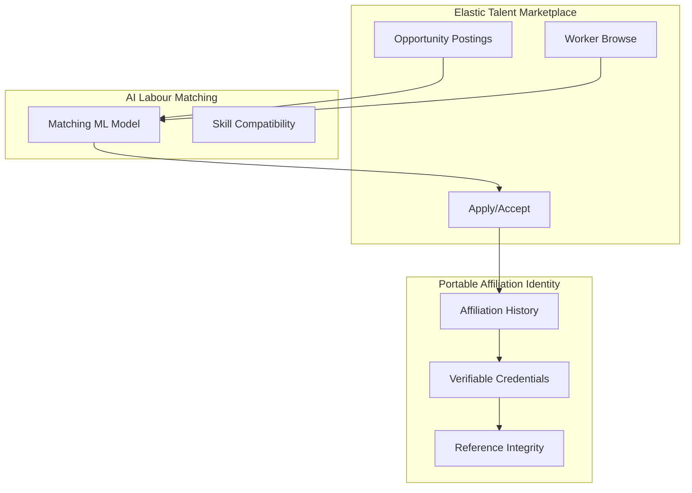

# Phase 3 — Multi-Employer Elastic Labour Market (Months 18–30)

**Goal:** Allow workers to maintain elastic affiliations across multiple employers. This creates true labour elasticity.

---

## Overview

Phase 3 transforms ElasticOS from single-employer elasticity into a **multi-employer talent ecosystem**. Workers can hold concurrent elastic affiliations (e.g. Employer A: 0.5, Employer B: 0.3), discover opportunities via a marketplace, and carry portable credential-backed affiliation history.



### Current Schema Support

The existing schema **already supports** multi-employer affiliations:

- `AffiliationSnapshot` has `@@unique([workerId, employerId])` — one snapshot per worker–employer pair
- A worker can have multiple snapshots (one per employer)
- `createOrAdjustAffiliation` supports creating affiliations; no global cap on total engagements per worker

Phase 3 adds: **discovery**, **matching**, and **portability** layers.

---

## Feature 10: Elastic Talent Marketplace

### Purpose

Workers can browse and accept additional elastic affiliations. Employers post opportunities (roles, intensity, duration).

### Example

| Employer | Engagement | Status   |
|----------|------------|---------|
| Employer A | 0.5      | Active  |
| Employer B | 0.3      | Active  |
| Total     | 0.8       | Headroom: 0.2 |

### Constraints

- **Total engagement cap**: Configurable (e.g. 1.0 or 1.2) — sum of intensities across employers
- **Conflict checks**: Optional exclusivity by industry/role
- **Minimum intensity**: Per-opportunity (e.g. ≥ 0.2)

### Backend Components

| Component | Description |
|-----------|-------------|
| **Opportunity posting service** | CRUD for opportunities; employer creates, worker browses |
| **Matching engine** | Filters opportunities by skills, availability, intensity headroom |
| **Application flow** | Worker applies → employer reviews → accept → create affiliation |

### Schema Additions

```prisma
model Opportunity {
  id              String   @id @default(cuid())
  employerId      String   @map("employer_id")
  title           String   @db.VarChar(200)
  description     String?  @db.Text
  engagementIntensity Decimal @map("engagement_intensity") @db.Decimal(5, 4)
  durationMonths  Int?     @map("duration_months")
  requiredSkills  String[] @map("required_skills")
  status          String   @default("OPEN")  // OPEN, CLOSED, FILLED
  createdAt       DateTime @default(now()) @map("created_at")
  updatedAt       DateTime @updatedAt @map("updated_at")

  employer Employer @relation(...)
  applications OpportunityApplication[]

  @@map("opportunities")
}

model OpportunityApplication {
  id            String   @id @default(cuid())
  opportunityId String   @map("opportunity_id")
  workerId      String   @map("worker_id")
  status        String   @default("PENDING")  // PENDING, ACCEPTED, REJECTED
  message       String?  @db.Text
  createdAt     DateTime @default(now()) @map("created_at")
  updatedAt     DateTime @updatedAt @map("updated_at")

  opportunity Opportunity @relation(...)
  worker       Worker     @relation(...)

  @@unique([opportunityId, workerId])
  @@map("opportunity_applications")
}

model WorkerAvailability {
  id              String   @id @default(cuid())
  workerId        String   @unique @map("worker_id")
  maxTotalEngagement Decimal @map("max_total_engagement") @db.Decimal(5, 4)  // e.g. 1.0
  openToOpportunities Boolean @default(true) @map("open_to_opportunities")
  updatedAt       DateTime @updatedAt @map("updated_at")

  worker Worker @relation(...)

  @@map("worker_availabilities")
}
```

### API

| Method | Path | Description |
|--------|------|-------------|
| GET | `/api/opportunities` | List opportunities (filter by employer, status, skills) |
| POST | `/api/employers/[id]/opportunities` | Create opportunity |
| GET | `/api/employers/[id]/opportunities` | Employer's opportunities |
| POST | `/api/opportunities/[id]/apply` | Worker applies |
| GET | `/api/opportunities/[id]/applications` | Employer lists applications |
| POST | `/api/opportunities/[id]/applications/[appId]/accept` | Employer accepts → create affiliation |
| GET | `/api/workers/[id]/availability` | Worker's availability / headroom |
| PUT | `/api/workers/[id]/availability` | Update availability |

---

## Feature 11: AI Labour Matching Engine

### Purpose

Match elastic workers to temporary roles, partial engagements, and project-based assignments using skills and compatibility.

### Backend Components

| Component | Description |
|-----------|-------------|
| **Matching ML model** | Ranking/scoring workers for opportunities (Phase 3b) |
| **Skill compatibility engine** | Overlap of `WorkerSkill` vs opportunity `requiredSkills`; proficiency weighting |
| **Availability check** | Current total engagement + opportunity intensity ≤ max |

### Matching Flow

1. **Employer posts opportunity** with required skills, intensity, duration
2. **Matching service** queries workers where:
   - `openToOpportunities = true`
   - `sum(current engagements) + opportunity.intensity ≤ maxTotalEngagement`
   - Skill overlap score above threshold
3. **Rank workers** by: skill match %, continuity score, reactivation probability
4. **Return ranked list** to employer (or worker-facing "recommended for you")

### Schema Additions

```prisma
model MatchingScore {
  id            String   @id @default(cuid())
  opportunityId String   @map("opportunity_id")
  workerId      String   @map("worker_id")
  score         Decimal  @db.Decimal(5, 4)
  skillMatchPct Decimal? @map("skill_match_pct") @db.Decimal(5, 4)
  computedAt    DateTime @default(now()) @map("computed_at")

  @@unique([opportunityId, workerId])
  @@map("matching_scores")
}
```

### API

| Method | Path | Description |
|--------|------|-------------|
| GET | `/api/opportunities/[id]/matches` | Ranked worker matches for opportunity |
| GET | `/api/workers/[id]/recommended-opportunities` | Opportunities recommended for worker |

### MVP vs Full ML

| Approach | MVP | Full ML |
|----------|-----|---------|
| Skill match | Jaccard / weighted overlap | Embedding similarity |
| Ranking | Rule-based (match + continuity) | Trained ranking model |
| Cold start | Popular opportunities first | Collaborative filtering |

---

## Feature 12: Portable Affiliation Identity

### Purpose

Worker affiliation history becomes portable across employers. New employers can verify past affiliations without contacting prior employers directly.

### Features

| Feature | Description |
|---------|-------------|
| **Verified affiliation records** | Cryptographic attestation that worker X had engagement Y with employer Z |
| **Institutional continuity preservation** | Aggregated continuity score across employers |
| **Reference integrity protection** | Tamper-evident; credentials can be verified by third parties |

### Backend Components

| Component | Description |
|-----------|-------------|
| **Verifiable credential system** | Issue VCs for affiliation records (W3C Verifiable Credentials, JWT or JSON-LD) |
| **Credential issuance** | On affiliation termination or on-demand; signed by ElasticOS (issuer) |
| **Credential verification** | Public endpoint or embedded proof for employers to verify |

### Credential Content (Example)

```json
{
  "@context": ["https://www.w3.org/2018/credentials/v1"],
  "type": ["VerifiableCredential", "ElasticAffiliationCredential"],
  "issuer": "https://elasticos.com",
  "issuanceDate": "2026-02-26T00:00:00Z",
  "credentialSubject": {
    "id": "worker-did",
    "employerId": "employer-id",
    "engagementIntensity": 0.5,
    "effectiveFrom": "2025-01-01",
    "effectiveTo": "2026-02-26",
    "recordType": "ADJUSTED"
  },
  "proof": { "type": "Ed25519Signature2020", ... }
}
```

### Schema Additions

```prisma
model AffiliationCredential {
  id              String   @id @default(cuid())
  workerId        String   @map("worker_id")
  recordId        String   @map("record_id")  // AffiliationRecord.id
  credentialJwt   String   @map("credential_jwt") @db.Text
  issuedAt        DateTime @default(now()) @map("issued_at")

  @@unique([recordId])
  @@map("affiliation_credentials")
}
```

### API

| Method | Path | Description |
|--------|------|-------------|
| POST | `/api/workers/[id]/credentials/request` | Request VC for affiliation record(s) |
| GET | `/api/credentials/verify` | Verify a presented credential (public or auth) |
| GET | `/api/workers/[id]/credentials` | List issued credentials (worker-only) |

### Implementation Notes

- **Issuer**: ElasticOS acts as issuer; private key for signing (HSM or KMS in prod)
- **Standards**: W3C VCs, optionally JSON-LD with linked data
- **Phase 3a**: Issue signed JWT payloads; verify via `/credentials/verify`
- **Phase 3b**: Full DID/VC stack, decentralised identifiers

---

## Implementation Order

| Order | Feature | Rationale |
|-------|---------|------------|
| 1 | **Feature 10: Elastic Talent Marketplace** | Core discovery and apply flow; no AI yet |
| 2 | **Feature 11: AI Labour Matching** | Adds value to marketplace; uses Opportunity + WorkerSkill |
| 3 | **Feature 12: Portable Affiliation Identity** | Independent; can ship after 10/11 |

### Dependency Graph

```
Feature 10 (Opportunity, Application)
    ↓
Feature 11 (Matching uses Opportunity + WorkerSkill)
    ↓
Feature 12 (VC uses AffiliationRecord — independent)
```

---

## Schema Summary (Phase 3)

| Model | Purpose |
|-------|---------|
| `Opportunity` | Employer posts elastic role/engagement |
| `OpportunityApplication` | Worker applies; employer accepts/rejects |
| `WorkerAvailability` | Max total engagement, open to opportunities flag |
| `MatchingScore` | Cached match scores (optional, for performance) |
| `AffiliationCredential` | Issued verifiable credentials |

---

## API Summary

| Domain | Endpoints |
|--------|----------|
| Opportunities | `GET/POST /api/opportunities`, `POST /api/employers/[id]/opportunities` |
| Applications | `POST /api/opportunities/[id]/apply`, `GET/POST accept` |
| Availability | `GET/PUT /api/workers/[id]/availability` |
| Matching | `GET /api/opportunities/[id]/matches`, `GET /api/workers/[id]/recommended-opportunities` |
| Credentials | `POST /api/workers/[id]/credentials/request`, `GET /api/credentials/verify` |

---

## Worker Flow (Multi-Employer)

1. Worker sets `maxTotalEngagement` (e.g. 1.0) and `openToOpportunities = true`
2. Worker browses `/marketplace/opportunities` (or `/worker/opportunities`)
3. Matching engine shows recommended opportunities based on skills + headroom
4. Worker applies; employer reviews applications
5. Employer accepts → `createOrAdjustAffiliation` for new worker–employer pair
6. Worker’s elastic dashboard shows all affiliations (Employer A, B, …)
7. On departure, worker can request verifiable credential for affiliation history

---

## Deployment

1. **Apply schema**: `cd packages/db && npm run db:push`
2. **Credential signing** (optional): Set `CREDENTIAL_SIGNING_SECRET` in production for JWT signing

## Security & Privacy

- **Worker data**: Skills, availability shared with employers only when applied; matching can be privacy-preserving (e.g. aggregate stats)
- **Credentials**: Worker controls which credentials to present; no centralised disclosure without consent
- **Employer data**: Opportunity details visible to workers browsing; applications visible only to posting employer
