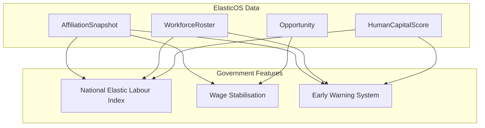

# Phase 4 — Government & National Statistics Integration (Months 24–36)

**Goal:** Transform labour market measurement. This is where the platform becomes national infrastructure.

---

## Overview

Phase 4 grants government users aggregated, policy-grade visibility into the elastic labour market and enables direct intervention: wage subsidies and early-warning signals for instability.



### RBAC

- **GOVERNMENT** role already exists
- Government APIs require `session.user.role === "GOVERNMENT"` or admin
- All Phase 4 endpoints return **aggregated** data only — no PII at worker/employer level unless explicitly permitted for audit

---

## Feature 13: National Elastic Labour Index Dashboard

### Purpose

Government sees national engagement intensity distribution, workforce elasticity metrics, and human capital continuity metrics.

### Metrics

| Metric | Description | Source |
|--------|-------------|--------|
| **Engagement intensity distribution** | Count of workers in each band (Full 80%+, Partial 50–80%, Elastic 30–50%, Minimal <30%) | `AffiliationSnapshot` |
| **Workforce elasticity rate** | % of workforce with engagement < 1.0 | Snapshots |
| **Human capital continuity** | Mean continuity score across workers | `AffiliationSnapshot.affiliationContinuityScore` |
| **Multi-employer rate** | % of workers with >1 affiliation | Snapshots grouped by workerId |
| **Opportunity pipeline** | Open opportunities count, applications count | `Opportunity`, `OpportunityApplication` |
| **Sector breakdown** | Optional: by industry (from `EmployerProfile.industry`) | Employer + Snapshot join |

### Backend Components

| Component | Description |
|-----------|-------------|
| **Aggregated analytics engine** | Queries over snapshots, roster, HC scores; outputs time-series or point-in-time aggregates |
| **Government reporting API** | `/api/government/*` — all endpoints require GOVERNMENT role |

### API

| Method | Path | Description |
|--------|------|-------------|
| GET | `/api/government/elastic-index` | National elastic labour index (distribution, elasticity rate, continuity) |
| GET | `/api/government/elastic-index/history` | Time-series (daily/weekly snapshots if materialised) |
| GET | `/api/government/elastic-index/by-industry` | Breakdown by employer industry (aggregated) |

### Schema Additions (Optional)

```prisma
model NationalElasticIndexSnapshot {
  id                String   @id @default(cuid())
  snapshotDate      DateTime @unique @map("snapshot_date")
  engagementDistribution Json  @map("engagement_distribution")
  elasticityRate    Decimal  @map("elasticity_rate") @db.Decimal(5, 4)
  meanContinuity    Decimal  @map("mean_continuity") @db.Decimal(5, 4)
  multiEmployerRate Decimal? @map("multi_employer_rate") @db.Decimal(5, 4)
  totalWorkers      Int      @map("total_workers")
  totalEmployers    Int      @map("total_employers")
  createdAt         DateTime @default(now()) @map("created_at")

  @@map("national_elastic_index_snapshots")
}
```

### UI

- **`/government/dashboard`** — National Elastic Labour Index dashboard
  - Engagement distribution chart
  - Elasticity rate gauge
  - Continuity metric
  - Multi-employer rate
  - (Optional) Sector breakdown table

---

## Feature 14: Wage Stabilisation Integration

### Purpose

Government can inject support based on engagement intensity. Example: subsidise workers below 0.6 engagement.

### Example Policy

- **Trigger**: Engagement intensity < 0.6
- **Subsidy**: £X per worker per month (or % of adjusted salary gap)
- **Co-payment**: Employer must maintain minimum engagement (e.g. 0.2)
- **Cap**: Max subsidy per worker, total budget

### Backend Components

| Component | Description |
|-----------|-------------|
| **Subsidy allocation engine** | Computes eligible workers, subsidy amounts, and allocation per policy |
| **Public finance integration API** | Export for payment systems; webhooks or file export for treasury |

### Policy Configuration

| Field | Description |
|-------|-------------|
| `maxEngagementThreshold` | Workers with intensity ≤ this are eligible (e.g. 0.6) |
| `minEngagementThreshold` | Workers must have intensity ≥ this (e.g. 0.2) |
| `subsidyAmountPerWorker` | Fixed £/month or formula |
| `totalBudget` | Cap on total subsidy |
| `effectiveFrom` / `effectiveTo` | Policy window |

### Schema Additions

```prisma
model SubsidyPolicy {
  id                    String   @id @default(cuid())
  name                  String   @db.VarChar(200)
  maxEngagementThreshold Decimal @map("max_engagement_threshold") @db.Decimal(5, 4)
  minEngagementThreshold Decimal @map("min_engagement_threshold") @db.Decimal(5, 4)
  subsidyAmountPerWorker Decimal @map("subsidy_amount_per_worker") @db.Decimal(12, 2)
  totalBudget           Decimal? @map("total_budget") @db.Decimal(14, 2)
  effectiveFrom         DateTime @map("effective_from")
  effectiveTo           DateTime? @map("effective_to")
  status                String   @default("DRAFT") @db.VarChar(20)
  createdAt             DateTime @default(now()) @map("created_at")

  @@map("subsidy_policies")
}

model SubsidyAllocation {
  id           String   @id @default(cuid())
  policyId     String   @map("policy_id")
  workerId     String   @map("worker_id")
  employerId   String   @map("employer_id")
  engagementIntensity Decimal @map("engagement_intensity") @db.Decimal(5, 4)
  subsidyAmount Decimal @map("subsidy_amount") @db.Decimal(12, 2)
  periodStart  DateTime @map("period_start")
  periodEnd    DateTime @map("period_end")
  status       String   @default("PENDING") @db.VarChar(20)
  createdAt    DateTime @default(now()) @map("created_at")

  policy   SubsidyPolicy @relation(...)
  worker   Worker       @relation(...)
  employer Employer     @relation(...)

  @@map("subsidy_allocations")
}
```

### API

| Method | Path | Description |
|--------|------|-------------|
| GET | `/api/government/subsidy-policies` | List policies |
| POST | `/api/government/subsidy-policies` | Create policy |
| GET | `/api/government/subsidy-policies/[id]/eligible` | Compute eligible workers (preview) |
| POST | `/api/government/subsidy-policies/[id]/allocate` | Run allocation for period |
| GET | `/api/government/subsidy-allocations` | List allocations (export for finance) |
| GET | `/api/government/subsidy-allocations/export` | CSV/JSON export for treasury |

---

## Feature 15: Labour Stability Early Warning System

### Purpose

Predict labour market instability, mass layoffs risk, and skill loss risk.

### Predictions

| Signal | Description | Data Sources |
|--------|-------------|--------------|
| **Labour market instability** | Volatility in engagement distribution, spike in terminations | AffiliationRecords, Snapshots |
| **Mass layoffs risk** | Employers with sudden drop in aggregate engagement | Snapshots by employer |
| **Skill loss risk** | Workers with decaying skills, low continuity | `WorkerSkillDecay`, `HumanCapitalScore` |

### Backend Components

| Component | Description |
|-----------|-------------|
| **Macro predictive ML model** | Time-series or classification model on aggregated features |
| **Feature pipeline** | Weekly/daily aggregates: termination rate, engagement volatility, skill decay rates |
| **Alert engine** | Thresholds or model outputs → alerts |

### MVP vs Full ML

| Approach | MVP | Full ML |
|----------|-----|---------|
| Instability | Rule: spike in TERMINATED records (week-over-week) | Time-series anomaly detection |
| Mass layoffs | Rule: employer with >X% workforce reduced in 30 days | Clustering + trend model |
| Skill loss | Rule: % workers with decay score < 0.7 | Regression on skill decay + continuity |

### Schema Additions

```prisma
model EarlyWarningAlert {
  id          String   @id @default(cuid())
  alertType   String   @map("alert_type")   // INSTABILITY, MASS_LAYOFF_RISK, SKILL_LOSS_RISK
  severity    String   @db.VarChar(20)      // LOW, MEDIUM, HIGH, CRITICAL
  summary     String   @db.Text
  payload     Json     // Affected employers/workers (IDs only, aggregated counts)
  triggeredAt DateTime @default(now()) @map("triggered_at")
  acknowledgedAt DateTime? @map("acknowledged_at")

  @@map("early_warning_alerts")
}
```

### API

| Method | Path | Description |
|--------|------|-------------|
| GET | `/api/government/early-warning` | Latest alerts |
| GET | `/api/government/early-warning/signals` | Current risk signals (computed on demand) |
| POST | `/api/government/early-warning/[id]/acknowledge` | Mark alert acknowledged |

---

## Implementation Order

| Order | Feature | Rationale |
|-------|---------|-----------|
| 1 | **Feature 13: National Elastic Labour Index** | Foundation dashboard; read-only aggregates |
| 2 | **Feature 14: Wage Stabilisation** | Policy + allocation; depends on understanding engagement distribution |
| 3 | **Feature 15: Early Warning System** | Builds on aggregates; can start with rule-based |

---

## API Summary

| Domain | Endpoints |
|--------|-----------|
| Elastic Index | `GET /api/government/elastic-index`, `/history`, `/by-industry` |
| Subsidy | `GET/POST /api/government/subsidy-policies`, `/eligible`, `/allocate` |
| Subsidy Allocations | `GET /api/government/subsidy-allocations`, `/export` |
| Early Warning | `GET /api/government/early-warning`, `/signals`, `POST .../acknowledge` |

---

## Security & Compliance

- **Data minimisation**: Government APIs return aggregates; no worker/employer identifiers unless required for subsidy allocation export
- **Audit**: All government actions (policy create, allocate) logged with `createdBy`
- **Access control**: Strict GOVERNMENT role check; consider separate admin flag for subsidy approval
- **Export**: Subsidy allocation export may include worker/employer IDs for payment reconciliation — restrict to authorised roles, encrypt in transit

---

## Deployment

1. **Schema**: Add `NationalElasticIndexSnapshot`, `SubsidyPolicy`, `SubsidyAllocation`, `EarlyWarningAlert`
2. **Background jobs**: Optional — nightly snapshots for index; periodic allocation runs
3. **Government dashboard**: Add route protection for `/government/*` (GOVERNMENT role only)
