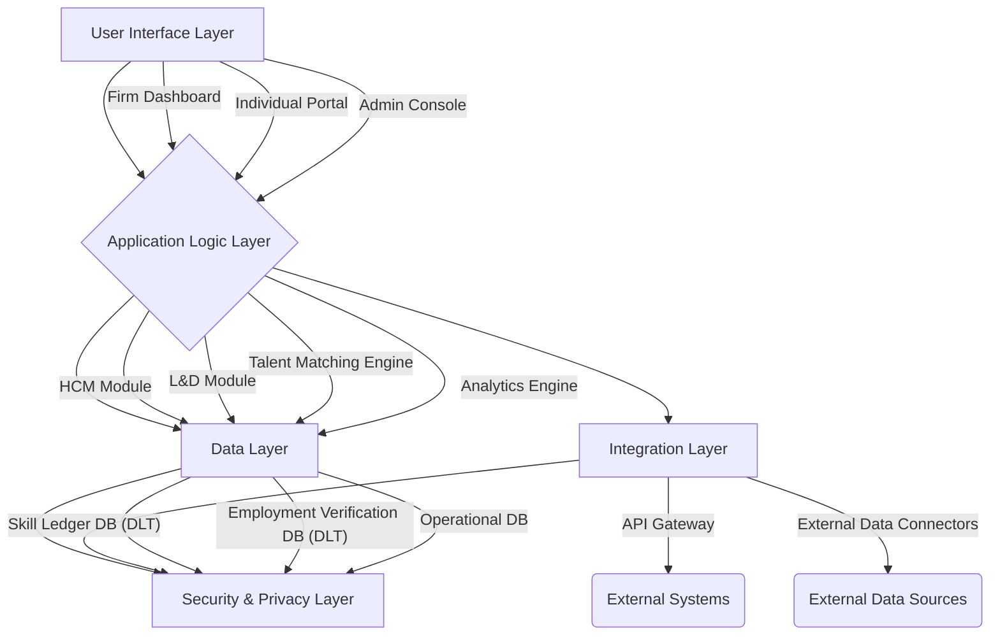

# Chapter 10: Digital Infrastructure for Elastic Employment

Chapter 9 elucidated the profound impact of AI on labor markets, demonstrating why elasticity is not merely beneficial but structurally necessary for navigating the AI-accelerated economy. This necessity, however, cannot be fully realized without a robust and intelligent **digital infrastructure**. The transition from rigid, binary employment to a fluid, elastic affiliation model demands sophisticated technological solutions that can manage dynamic engagement tiers, track evolving skill sets, verify professional histories, and facilitate efficient matching between human capital and organizational needs. This chapter outlines the essential components of such a digital infrastructure, focusing on skill ledgers, dynamic employment verification systems, AI-assisted capability mapping, and advanced labor market matching algorithms, culminating in a proposed platform architecture for Elastic Affiliation.

## Skill Ledgers

In an era of rapid skill half-life compression and the collapse of static job descriptions (as discussed in Chapter 4 and 9), the traditional resume or curriculum vitae (CV) is becoming increasingly inadequate for capturing and communicating an individual's true capabilities. The Elastic Affiliation Model necessitates a more dynamic, verifiable, and granular approach to skill representation: **Skill Ledgers**. A skill ledger is a digital, continuously updated record of an individual's competencies, qualifications, experiences, and learning achievements, often leveraging distributed ledger technology (DLT) or blockchain for immutability and verifiable authenticity [1].

Key characteristics and benefits of Skill Ledgers include:

1.  **Verifiable and Immutable Records:** By utilizing blockchain technology, skill ledgers can provide tamper-proof records of certifications, course completions, project contributions, and performance evaluations. This eliminates the problem of fraudulent credentials and provides employers with a high degree of confidence in an individual's stated abilities. Each entry in the ledger could be cryptographically signed by the issuing institution (e.g., university, training provider, employer), ensuring its authenticity [2].

2.  **Granular Skill Representation:** Unlike broad job titles, skill ledgers can break down competencies into granular, machine-readable units. For example, instead of simply stating 
## Dynamic Employment Verification Systems

Building upon the concept of skill ledgers, **dynamic employment verification systems** are crucial for providing real-time, verifiable information about an individual's current and past employment affiliations. In an elastic labor market, where individuals may move between different engagement tiers, work on multiple projects, or have periods of reduced hours, traditional employment verification methods (e.g., calling a previous employer) become cumbersome and often inadequate. These systems leverage digital technologies to provide instant, secure, and accurate verification of employment status, roles, and contributions [4].

Key features of Dynamic Employment Verification Systems include:

*   **Real-time Status Updates:** These systems would provide immediate verification of an individual's current engagement status with a firm, including their active engagement tier (e.g., full-time, reduced-hour, project-based). This is particularly important for financial institutions (e.g., mortgage lenders) or other employers seeking to verify current employment status in a fluid environment.
*   **Verifiable Employment History:** Similar to skill ledgers, employment history could be recorded on a distributed ledger, with each employment period and engagement tier cryptographically signed by the employer. This provides an immutable and verifiable record of an individual's professional journey, mitigating the negative signalling associated with employment gaps in traditional systems.
*   **Reference Continuity:** As discussed in Chapter 7, these systems would facilitate reference continuity by allowing firms to formally attest to an individual's contributions and skills during all periods of affiliation, not just full-time employment. This could include automated generation of reference letters based on verified project completions and performance reviews.
*   **Privacy and Consent Controls:** Individuals would have granular control over who can access their employment verification data and for what purpose. This ensures privacy and empowers individuals to manage their professional information, aligning with self-sovereign identity principles.
*   **Integration with Social Security and Benefits:** Ideally, these systems would integrate with national social security and unemployment insurance systems, allowing for seamless administration of benefits based on dynamic employment statuses. This would facilitate the implementation of government co-insurance mechanisms (Chapter 11) and portable benefit models.

Dynamic employment verification systems are essential for building trust and transparency in an elastic labor market. They provide the necessary infrastructure for firms to confidently engage with a flexible workforce and for individuals to seamlessly navigate diverse employment pathways, without being penalized by outdated verification methods.

## AI-Assisted Capability Mapping

To effectively manage and deploy human capital in an elastic environment, organizations need sophisticated tools for understanding the current and potential capabilities of their workforce. **AI-assisted capability mapping** leverages artificial intelligence and machine learning to analyze skill ledgers, project histories, performance data, and learning activities to create a dynamic, comprehensive map of an organization's human capital. This goes beyond simple skill inventories to identify emerging competencies, potential skill gaps, and optimal talent allocation strategies [5].

Key functions of AI-assisted capability mapping include:

*   **Dynamic Skill Gap Analysis:** AI algorithms can continuously analyze the skills present in the workforce against the skills required for current and future strategic objectives. This allows firms to proactively identify skill gaps and design targeted reskilling and upskilling programs, aligning with the protected upskilling allocation principle.
*   **Talent Mobility and Project Matching:** By understanding the granular skills and experiences of each affiliate, AI can facilitate internal talent mobility, matching individuals to new projects or roles that align with their development goals and the firm's needs. This is crucial for project-based structures and for optimizing the deployment of human capital across different engagement tiers.
*   **Personalized Learning Pathways:** AI can recommend personalized learning pathways for individuals based on their current skill set, career aspirations, and identified skill gaps. This supports continuous learning and helps individuals navigate the compression of skill half-lives, ensuring their relevance in the AI economy.
*   **Predictive Analytics for Workforce Planning:** AI can analyze historical data on skill trends, project demands, and employee development to predict future workforce needs. This enables proactive workforce planning, allowing firms to anticipate skill requirements and develop strategies for talent acquisition and development well in advance.
*   **Identification of Tacit Knowledge:** While challenging, AI can assist in identifying potential sources of tacit knowledge within the organization by analyzing communication patterns, project collaborations, and performance data. This helps in preserving and leveraging this invaluable asset, particularly during periods of workforce adjustment.

AI-assisted capability mapping transforms human capital management from a static, reactive process into a dynamic, proactive, and data-driven function. It empowers firms to make informed decisions about talent development and deployment, maximizing the value of their human capital in an elastic environment.

## Labour Market Matching Algorithms

The efficiency of an elastic labor market, both within and between organizations, hinges on the ability to effectively match individuals with opportunities. **Labor market matching algorithms**, powered by AI and advanced analytics, are designed to optimize this process, connecting skilled individuals with suitable projects, roles, or engagement tiers. These algorithms move beyond simple keyword matching to consider a multitude of factors, including skills, experience, career aspirations, cultural fit, and the dynamic needs of the firm [6].

Key features of advanced labor market matching algorithms include:

*   **Multi-dimensional Matching:** Algorithms can match individuals to opportunities based on a rich dataset derived from skill ledgers, employment verification systems, and capability mapping. This includes not only technical skills but also soft skills, learning agility, project preferences, and availability.
*   **Dynamic Opportunity Identification:** These algorithms can continuously scan internal and external labor markets for emerging opportunities that align with the skills and development goals of affiliated individuals. This includes identifying short-term projects, reduced-hour roles, or upskilling opportunities.
*   **Bias Mitigation:** Designed with ethical AI principles, these algorithms can incorporate mechanisms to mitigate unconscious bias in hiring and allocation decisions, promoting fairness and diversity in the elastic labor market.
*   **Predictive Matching:** Algorithms can predict the likelihood of a successful match between an individual and an opportunity, based on historical data and performance indicators. This helps firms make more informed decisions and reduces turnover.
*   **Personalized Recommendations:** For individuals, these algorithms can provide personalized recommendations for career pathways, learning opportunities, and potential engagements, empowering them to proactively manage their portfolio careers.

By optimizing the matching process, labor market matching algorithms enhance the fluidity and efficiency of the elastic labor market, ensuring that human capital is deployed where it can create the most value, both for individuals and organizations.

## Propose a Platform Architecture

To integrate these digital components into a cohesive and functional system, this thesis proposes a **Platform Architecture for Elastic Affiliation**. This platform would serve as the central nervous system for managing human capital in an elastic environment, providing a unified interface for firms, individuals, and potentially government agencies. The architecture is designed to be modular, scalable, and secure, leveraging modern cloud and distributed ledger technologies.

### Core Components of the Platform Architecture:

1.  **User Interface (UI) Layer:**
    *   **Firm Dashboard:** Provides firms with an overview of their human capital, including capability maps, skill gaps, and tools for managing engagement tiers and activating elasticity bands. It would also include analytics on human capital utilization and development.
    *   **Individual Portal:** Empowers individuals to manage their skill ledger, view employment verification data, access personalized learning pathways, explore internal and external opportunities, and manage their engagement contracts.
    *   **Administrator Console:** For platform administrators to manage user access, data integrity, and system configurations.

2.  **Application Logic Layer:**
    *   **Human Capital Management (HCM) Module:** Core functionality for managing employee data, engagement tiers, compensation modulation, and performance re-scaling.
    *   **Learning and Development (L&D) Module:** Integrates with internal and external learning platforms, tracks upskilling progress, and provides personalized learning recommendations.
    *   **Talent Matching Engine:** Implements AI-powered labor market matching algorithms to connect individuals with opportunities.
    *   **Analytics and Reporting Engine:** Generates insights on human capital trends, HCEC metrics, and the effectiveness of elastic strategies.

3.  **Data Layer:**
    *   **Skill Ledger Database (DLT-based):** A distributed ledger technology (e.g., blockchain) to store verifiable and immutable skill and credential records. This ensures data integrity and authenticity.
    *   **Employment Verification Database (DLT-based):** A distributed ledger to store verifiable employment history and engagement status, cryptographically signed by employers.
    *   **Operational Database:** Stores dynamic data related to engagement contracts, performance metrics, project assignments, and compensation details.

4.  **Integration Layer:**
    *   **API Gateway:** Provides secure and standardized APIs for integration with external systems, such as HRIS, payroll systems, learning management systems (LMS), and government social security platforms.
    *   **External Data Connectors:** For pulling in external labor market data, industry skill trends, and economic indicators to inform AI-assisted capability mapping and matching algorithms.

5.  **Security and Privacy Layer:**
    *   **Identity and Access Management (IAM):** Ensures secure authentication and authorization for all users, with granular control over data access.
    *   **Data Encryption:** All sensitive data at rest and in transit is encrypted to protect privacy.
    *   **Compliance Engine:** Ensures adherence to data protection regulations (e.g., GDPR, CCPA) and labor laws across different jurisdictions.

### Proposed Platform Architecture Diagram (Conceptual)

This platform architecture provides the technological backbone for the Elastic Affiliation Model, enabling firms to manage their human capital with unprecedented agility and transparency, while empowering individuals to navigate the complexities of the AI-accelerated labor market with greater security and control. It transforms the abstract concepts of elasticity into a tangible, operational system, paving the way for a more resilient and equitable future of work.

### References

[1] Deloitte. (2018). *Blockchain in HR: The future of work*. [https://www2.deloitte.com/content/dam/Deloitte/nl/Documents/human-capital/deloitte-nl-hc-blockchain-in-hr.pdf](https://www2.deloitte.com/content/dam/Deloitte/nl/Documents/human-capital/deloitte-nl-hc-blockchain-in-hr.pdf)
[2] Swan, M. (2015). *Blockchain: Blueprint for a New Economy*. O'Reilly Media.
[3] Bersin, J. (2017). *The Employee Experience: Culture, Engagement, and Beyond*. Deloitte University Press.
[4] World Economic Forum. (2018). *The Future of Jobs Report 2018*. [https://www.weforum.org/reports/the-future-of-jobs-report-2018](https://www.weforum.org/reports/the-future-of-jobs-report-2018)
[5] IBM. (2020). *AI in HR: How artificial intelligence is transforming human resources*. [https://www.ibm.com/downloads/cas/XQG0XJ4L](https://www.ibm.com/downloads/cas/XQG0XJ4L)
[6] Acemoglu, D., & Autor, D. (2011). Skills, Tasks and Technologies: Implications for Employment and Earnings. In O. Ashenfelter & D. Card (Eds.), *Handbook of Labor Economics* (Vol. 4B, pp. 1043-1171). Elsevier.
